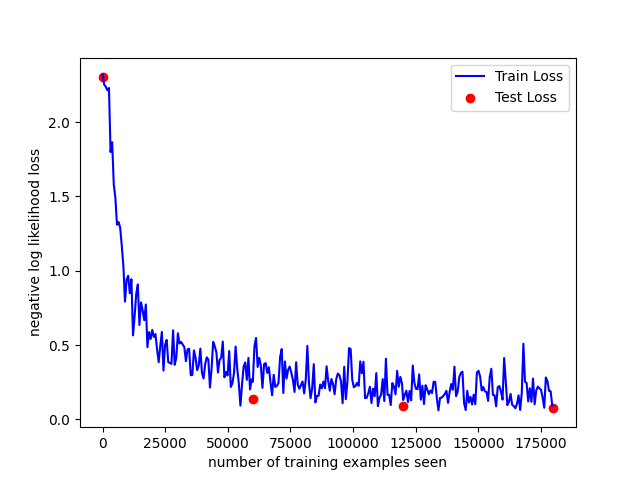

```
PS D:\Git\ai\homework\07> python -W ignore train.py lenet

Test set: Avg. loss: 2.3029, Accuracy: 1032/10000 (10%)

Train Epoch: 1 [0/60000 (0%)]   Loss: 2.300008
Train Epoch: 1 [640/60000 (1%)] Loss: 2.285968
Train Epoch: 1 [1280/60000 (2%)]        Loss: 2.294395
Train Epoch: 1 [1920/60000 (3%)]        Loss: 2.299851
Train Epoch: 1 [2560/60000 (4%)]        Loss: 2.308716
Train Epoch: 1 [3200/60000 (5%)]        Loss: 2.301975
Train Epoch: 1 [3840/60000 (6%)]        Loss: 2.286121
Train Epoch: 1 [4480/60000 (7%)]        Loss: 2.285073
Train Epoch: 1 [5120/60000 (9%)]        Loss: 2.302235
Train Epoch: 1 [5760/60000 (10%)]       Loss: 2.295687
Train Epoch: 1 [6400/60000 (11%)]       Loss: 2.286645
Train Epoch: 1 [7040/60000 (12%)]       Loss: 2.282484
Train Epoch: 1 [7680/60000 (13%)]       Loss: 2.281316
Train Epoch: 1 [8320/60000 (14%)]       Loss: 2.270794
Train Epoch: 1 [8960/60000 (15%)]       Loss: 2.279618
Train Epoch: 1 [9600/60000 (16%)]       Loss: 2.270370
Train Epoch: 1 [10240/60000 (17%)]      Loss: 2.266463
Train Epoch: 1 [10880/60000 (18%)]      Loss: 2.246520
Train Epoch: 1 [11520/60000 (19%)]      Loss: 2.255146
Train Epoch: 1 [12160/60000 (20%)]      Loss: 2.226075
Train Epoch: 1 [12800/60000 (21%)]      Loss: 2.190179
Train Epoch: 1 [13440/60000 (22%)]      Loss: 2.158946
Train Epoch: 1 [14080/60000 (23%)]      Loss: 2.125964
Train Epoch: 1 [14720/60000 (25%)]      Loss: 2.031829
Train Epoch: 1 [15360/60000 (26%)]      Loss: 1.971389
Train Epoch: 1 [16000/60000 (27%)]      Loss: 1.795756
Train Epoch: 1 [16640/60000 (28%)]      Loss: 1.508122
Train Epoch: 1 [17280/60000 (29%)]      Loss: 1.297957
Train Epoch: 1 [17920/60000 (30%)]      Loss: 1.139328
Train Epoch: 1 [18560/60000 (31%)]      Loss: 0.885685
Train Epoch: 1 [19200/60000 (32%)]      Loss: 0.760497
Train Epoch: 1 [19840/60000 (33%)]      Loss: 0.621852
Train Epoch: 1 [20480/60000 (34%)]      Loss: 0.597452
Train Epoch: 1 [21120/60000 (35%)]      Loss: 0.618888
Train Epoch: 1 [21760/60000 (36%)]      Loss: 0.862274
Train Epoch: 1 [22400/60000 (37%)]      Loss: 0.671753
Train Epoch: 1 [23040/60000 (38%)]      Loss: 0.620768
Train Epoch: 1 [23680/60000 (39%)]      Loss: 0.684960
Train Epoch: 1 [24320/60000 (41%)]      Loss: 0.656583
Train Epoch: 1 [24960/60000 (42%)]      Loss: 0.491330
Train Epoch: 1 [25600/60000 (43%)]      Loss: 1.033950
Train Epoch: 1 [26240/60000 (44%)]      Loss: 0.474045
Train Epoch: 1 [26880/60000 (45%)]      Loss: 0.427305
Train Epoch: 1 [27520/60000 (46%)]      Loss: 0.537454
Train Epoch: 1 [28160/60000 (47%)]      Loss: 0.442922
Train Epoch: 1 [28800/60000 (48%)]      Loss: 0.500414
Train Epoch: 1 [29440/60000 (49%)]      Loss: 0.685593
Train Epoch: 1 [30080/60000 (50%)]      Loss: 0.602957
Train Epoch: 1 [30720/60000 (51%)]      Loss: 0.280734
Train Epoch: 1 [31360/60000 (52%)]      Loss: 0.510690
Train Epoch: 1 [32000/60000 (53%)]      Loss: 0.465313
Train Epoch: 1 [32640/60000 (54%)]      Loss: 0.654005
Train Epoch: 1 [33280/60000 (55%)]      Loss: 0.389863
Train Epoch: 1 [33920/60000 (57%)]      Loss: 0.575873
Train Epoch: 1 [34560/60000 (58%)]      Loss: 0.342528
Train Epoch: 1 [35200/60000 (59%)]      Loss: 0.453314
Train Epoch: 1 [35840/60000 (60%)]      Loss: 0.394694
Train Epoch: 1 [36480/60000 (61%)]      Loss: 0.347185
Train Epoch: 1 [37120/60000 (62%)]      Loss: 0.217753
Train Epoch: 1 [37760/60000 (63%)]      Loss: 0.377401
Train Epoch: 1 [38400/60000 (64%)]      Loss: 0.448402
Train Epoch: 1 [39040/60000 (65%)]      Loss: 0.326088
Train Epoch: 1 [39680/60000 (66%)]      Loss: 0.342849
Train Epoch: 1 [40320/60000 (67%)]      Loss: 0.349434
Train Epoch: 1 [40960/60000 (68%)]      Loss: 0.180289
Train Epoch: 1 [41600/60000 (69%)]      Loss: 0.474053
Train Epoch: 1 [42240/60000 (70%)]      Loss: 0.543782
Train Epoch: 1 [42880/60000 (71%)]      Loss: 0.198052
Train Epoch: 1 [43520/60000 (72%)]      Loss: 0.371276
Train Epoch: 1 [44160/60000 (74%)]      Loss: 0.241303
Train Epoch: 1 [44800/60000 (75%)]      Loss: 0.592649
Train Epoch: 1 [45440/60000 (76%)]      Loss: 0.527105
Train Epoch: 1 [46080/60000 (77%)]      Loss: 0.320223
Train Epoch: 1 [46720/60000 (78%)]      Loss: 0.336198
Train Epoch: 1 [47360/60000 (79%)]      Loss: 0.557678
Train Epoch: 1 [48000/60000 (80%)]      Loss: 0.583389
Train Epoch: 1 [48640/60000 (81%)]      Loss: 0.191522
Train Epoch: 1 [49280/60000 (82%)]      Loss: 0.288929
Train Epoch: 1 [49920/60000 (83%)]      Loss: 0.248767
Train Epoch: 1 [50560/60000 (84%)]      Loss: 0.423673
Train Epoch: 1 [51200/60000 (85%)]      Loss: 0.602584
Train Epoch: 1 [51840/60000 (86%)]      Loss: 0.227042
Train Epoch: 1 [52480/60000 (87%)]      Loss: 0.253392
Train Epoch: 1 [53120/60000 (88%)]      Loss: 0.359602
Train Epoch: 1 [53760/60000 (90%)]      Loss: 0.405965
Train Epoch: 1 [54400/60000 (91%)]      Loss: 0.332876
Train Epoch: 1 [55040/60000 (92%)]      Loss: 0.309412
Train Epoch: 1 [55680/60000 (93%)]      Loss: 0.496290
Train Epoch: 1 [56320/60000 (94%)]      Loss: 0.235738
Train Epoch: 1 [56960/60000 (95%)]      Loss: 0.196705
Train Epoch: 1 [57600/60000 (96%)]      Loss: 0.333688
Train Epoch: 1 [58240/60000 (97%)]      Loss: 0.418020
Train Epoch: 1 [58880/60000 (98%)]      Loss: 0.315965
Train Epoch: 1 [59520/60000 (99%)]      Loss: 0.305438

Test set: Avg. loss: 0.2863, Accuracy: 9099/10000 (91%)

Train Epoch: 2 [0/60000 (0%)]   Loss: 0.257614
Train Epoch: 2 [640/60000 (1%)] Loss: 0.249805
Train Epoch: 2 [1280/60000 (2%)]        Loss: 0.356185
Train Epoch: 2 [1920/60000 (3%)]        Loss: 0.435705
Train Epoch: 2 [2560/60000 (4%)]        Loss: 0.309877
Train Epoch: 2 [3200/60000 (5%)]        Loss: 0.309450
Train Epoch: 2 [3840/60000 (6%)]        Loss: 0.288568
Train Epoch: 2 [4480/60000 (7%)]        Loss: 0.174305
Train Epoch: 2 [5120/60000 (9%)]        Loss: 0.127331
Train Epoch: 2 [5760/60000 (10%)]       Loss: 0.327037
Train Epoch: 2 [6400/60000 (11%)]       Loss: 0.227782
Train Epoch: 2 [7040/60000 (12%)]       Loss: 0.252482
Train Epoch: 2 [7680/60000 (13%)]       Loss: 0.277102
Train Epoch: 2 [8320/60000 (14%)]       Loss: 0.203175
Train Epoch: 2 [8960/60000 (15%)]       Loss: 0.219343
Train Epoch: 2 [9600/60000 (16%)]       Loss: 0.338202
Train Epoch: 2 [10240/60000 (17%)]      Loss: 0.470760
Train Epoch: 2 [10880/60000 (18%)]      Loss: 0.260769
Train Epoch: 2 [11520/60000 (19%)]      Loss: 0.086298
Train Epoch: 2 [12160/60000 (20%)]      Loss: 0.301167
Train Epoch: 2 [12800/60000 (21%)]      Loss: 0.340049
Train Epoch: 2 [13440/60000 (22%)]      Loss: 0.113801
Train Epoch: 2 [14080/60000 (23%)]      Loss: 0.179867
Train Epoch: 2 [14720/60000 (25%)]      Loss: 0.321704
Train Epoch: 2 [15360/60000 (26%)]      Loss: 0.328709
Train Epoch: 2 [16000/60000 (27%)]      Loss: 0.260828
Train Epoch: 2 [16640/60000 (28%)]      Loss: 0.228276
Train Epoch: 2 [17280/60000 (29%)]      Loss: 0.203349
Train Epoch: 2 [17920/60000 (30%)]      Loss: 0.233741
Train Epoch: 2 [18560/60000 (31%)]      Loss: 0.317832
Train Epoch: 2 [19200/60000 (32%)]      Loss: 0.196645
Train Epoch: 2 [19840/60000 (33%)]      Loss: 0.163190
Train Epoch: 2 [20480/60000 (34%)]      Loss: 0.263576
Train Epoch: 2 [21120/60000 (35%)]      Loss: 0.272876
Train Epoch: 2 [21760/60000 (36%)]      Loss: 0.057404
Train Epoch: 2 [22400/60000 (37%)]      Loss: 0.150943
Train Epoch: 2 [23040/60000 (38%)]      Loss: 0.271743
Train Epoch: 2 [23680/60000 (39%)]      Loss: 0.118751
Train Epoch: 2 [24320/60000 (41%)]      Loss: 0.182737
Train Epoch: 2 [24960/60000 (42%)]      Loss: 0.148687
Train Epoch: 2 [25600/60000 (43%)]      Loss: 0.098569
Train Epoch: 2 [26240/60000 (44%)]      Loss: 0.263488
Train Epoch: 2 [26880/60000 (45%)]      Loss: 0.208792
Train Epoch: 2 [27520/60000 (46%)]      Loss: 0.180971
Train Epoch: 2 [28160/60000 (47%)]      Loss: 0.166878
Train Epoch: 2 [28800/60000 (48%)]      Loss: 0.135668
Train Epoch: 2 [29440/60000 (49%)]      Loss: 0.380756
Train Epoch: 2 [30080/60000 (50%)]      Loss: 0.248516
Train Epoch: 2 [30720/60000 (51%)]      Loss: 0.103795
Train Epoch: 2 [31360/60000 (52%)]      Loss: 0.232932
Train Epoch: 2 [32000/60000 (53%)]      Loss: 0.312611
Train Epoch: 2 [32640/60000 (54%)]      Loss: 0.139947
Train Epoch: 2 [33280/60000 (55%)]      Loss: 0.110470
Train Epoch: 2 [33920/60000 (57%)]      Loss: 0.310027
Train Epoch: 2 [34560/60000 (58%)]      Loss: 0.058130
Train Epoch: 2 [35200/60000 (59%)]      Loss: 0.184300
Train Epoch: 2 [35840/60000 (60%)]      Loss: 0.407696
Train Epoch: 2 [36480/60000 (61%)]      Loss: 0.235925
Train Epoch: 2 [37120/60000 (62%)]      Loss: 0.189324
Train Epoch: 2 [37760/60000 (63%)]      Loss: 0.106652
Train Epoch: 2 [38400/60000 (64%)]      Loss: 0.210925
Train Epoch: 2 [39040/60000 (65%)]      Loss: 0.261021
Train Epoch: 2 [39680/60000 (66%)]      Loss: 0.222349
Train Epoch: 2 [40320/60000 (67%)]      Loss: 0.090295
Train Epoch: 2 [40960/60000 (68%)]      Loss: 0.231636
Train Epoch: 2 [41600/60000 (69%)]      Loss: 0.193428
Train Epoch: 2 [42240/60000 (70%)]      Loss: 0.122126
Train Epoch: 2 [42880/60000 (71%)]      Loss: 0.177503
Train Epoch: 2 [43520/60000 (72%)]      Loss: 0.190142
Train Epoch: 2 [44160/60000 (74%)]      Loss: 0.179882
Train Epoch: 2 [44800/60000 (75%)]      Loss: 0.157407
Train Epoch: 2 [45440/60000 (76%)]      Loss: 0.173648
Train Epoch: 2 [46080/60000 (77%)]      Loss: 0.149339
Train Epoch: 2 [46720/60000 (78%)]      Loss: 0.193501
Train Epoch: 2 [47360/60000 (79%)]      Loss: 0.142866
Train Epoch: 2 [48000/60000 (80%)]      Loss: 0.156571
Train Epoch: 2 [48640/60000 (81%)]      Loss: 0.237014
Train Epoch: 2 [49280/60000 (82%)]      Loss: 0.217638
Train Epoch: 2 [49920/60000 (83%)]      Loss: 0.326674
Train Epoch: 2 [50560/60000 (84%)]      Loss: 0.143637
Train Epoch: 2 [51200/60000 (85%)]      Loss: 0.121933
Train Epoch: 2 [51840/60000 (86%)]      Loss: 0.231470
Train Epoch: 2 [52480/60000 (87%)]      Loss: 0.270612
Train Epoch: 2 [53120/60000 (88%)]      Loss: 0.197713
Train Epoch: 2 [53760/60000 (90%)]      Loss: 0.377544
Train Epoch: 2 [54400/60000 (91%)]      Loss: 0.203205
Train Epoch: 2 [55040/60000 (92%)]      Loss: 0.268528
Train Epoch: 2 [55680/60000 (93%)]      Loss: 0.123220
Train Epoch: 2 [56320/60000 (94%)]      Loss: 0.319500
Train Epoch: 2 [56960/60000 (95%)]      Loss: 0.120821
Train Epoch: 2 [57600/60000 (96%)]      Loss: 0.181401
Train Epoch: 2 [58240/60000 (97%)]      Loss: 0.221242
Train Epoch: 2 [58880/60000 (98%)]      Loss: 0.195083
Train Epoch: 2 [59520/60000 (99%)]      Loss: 0.244853

Test set: Avg. loss: 0.1968, Accuracy: 9334/10000 (93%)

Train Epoch: 3 [0/60000 (0%)]   Loss: 0.203197
Train Epoch: 3 [640/60000 (1%)] Loss: 0.033820
Train Epoch: 3 [1280/60000 (2%)]        Loss: 0.218972
Train Epoch: 3 [1920/60000 (3%)]        Loss: 0.142454
Train Epoch: 3 [2560/60000 (4%)]        Loss: 0.136253
Train Epoch: 3 [3200/60000 (5%)]        Loss: 0.087973
Train Epoch: 3 [3840/60000 (6%)]        Loss: 0.288532
Train Epoch: 3 [4480/60000 (7%)]        Loss: 0.169481
Train Epoch: 3 [5120/60000 (9%)]        Loss: 0.156129
Train Epoch: 3 [5760/60000 (10%)]       Loss: 0.044548
Train Epoch: 3 [6400/60000 (11%)]       Loss: 0.097894
Train Epoch: 3 [7040/60000 (12%)]       Loss: 0.090350
Train Epoch: 3 [7680/60000 (13%)]       Loss: 0.088168
Train Epoch: 3 [8320/60000 (14%)]       Loss: 0.151124
Train Epoch: 3 [8960/60000 (15%)]       Loss: 0.426204
Train Epoch: 3 [9600/60000 (16%)]       Loss: 0.110461
Train Epoch: 3 [10240/60000 (17%)]      Loss: 0.106040
Train Epoch: 3 [10880/60000 (18%)]      Loss: 0.302783
Train Epoch: 3 [11520/60000 (19%)]      Loss: 0.157500
Train Epoch: 3 [12160/60000 (20%)]      Loss: 0.177752
Train Epoch: 3 [12800/60000 (21%)]      Loss: 0.177241
Train Epoch: 3 [13440/60000 (22%)]      Loss: 0.219665
Train Epoch: 3 [14080/60000 (23%)]      Loss: 0.127426
Train Epoch: 3 [14720/60000 (25%)]      Loss: 0.258989
Train Epoch: 3 [15360/60000 (26%)]      Loss: 0.132310
Train Epoch: 3 [16000/60000 (27%)]      Loss: 0.276449
Train Epoch: 3 [16640/60000 (28%)]      Loss: 0.124505
Train Epoch: 3 [17280/60000 (29%)]      Loss: 0.241053
Train Epoch: 3 [17920/60000 (30%)]      Loss: 0.163207
Train Epoch: 3 [18560/60000 (31%)]      Loss: 0.103566
Train Epoch: 3 [19200/60000 (32%)]      Loss: 0.074737
Train Epoch: 3 [19840/60000 (33%)]      Loss: 0.202979
Train Epoch: 3 [20480/60000 (34%)]      Loss: 0.385776
Train Epoch: 3 [21120/60000 (35%)]      Loss: 0.143638
Train Epoch: 3 [21760/60000 (36%)]      Loss: 0.253391
Train Epoch: 3 [22400/60000 (37%)]      Loss: 0.084563
Train Epoch: 3 [23040/60000 (38%)]      Loss: 0.214898
Train Epoch: 3 [23680/60000 (39%)]      Loss: 0.160595
Train Epoch: 3 [24320/60000 (41%)]      Loss: 0.049560
Train Epoch: 3 [24960/60000 (42%)]      Loss: 0.306917
Train Epoch: 3 [25600/60000 (43%)]      Loss: 0.131516
Train Epoch: 3 [26240/60000 (44%)]      Loss: 0.190745
Train Epoch: 3 [26880/60000 (45%)]      Loss: 0.180164
Train Epoch: 3 [27520/60000 (46%)]      Loss: 0.282125
Train Epoch: 3 [28160/60000 (47%)]      Loss: 0.101510
Train Epoch: 3 [28800/60000 (48%)]      Loss: 0.251745
Train Epoch: 3 [29440/60000 (49%)]      Loss: 0.050331
Train Epoch: 3 [30080/60000 (50%)]      Loss: 0.146497
Train Epoch: 3 [30720/60000 (51%)]      Loss: 0.155911
Train Epoch: 3 [31360/60000 (52%)]      Loss: 0.154842
Train Epoch: 3 [32000/60000 (53%)]      Loss: 0.200353
Train Epoch: 3 [32640/60000 (54%)]      Loss: 0.092296
Train Epoch: 3 [33280/60000 (55%)]      Loss: 0.051716
Train Epoch: 3 [33920/60000 (57%)]      Loss: 0.019574
Train Epoch: 3 [34560/60000 (58%)]      Loss: 0.137249
Train Epoch: 3 [35200/60000 (59%)]      Loss: 0.036015
Train Epoch: 3 [35840/60000 (60%)]      Loss: 0.079046
Train Epoch: 3 [36480/60000 (61%)]      Loss: 0.137136
Train Epoch: 3 [37120/60000 (62%)]      Loss: 0.101711
Train Epoch: 3 [37760/60000 (63%)]      Loss: 0.133134
Train Epoch: 3 [38400/60000 (64%)]      Loss: 0.174325
Train Epoch: 3 [39040/60000 (65%)]      Loss: 0.224989
Train Epoch: 3 [39680/60000 (66%)]      Loss: 0.215086
Train Epoch: 3 [40320/60000 (67%)]      Loss: 0.158175
Train Epoch: 3 [40960/60000 (68%)]      Loss: 0.156111
Train Epoch: 3 [41600/60000 (69%)]      Loss: 0.066688
Train Epoch: 3 [42240/60000 (70%)]      Loss: 0.183405
Train Epoch: 3 [42880/60000 (71%)]      Loss: 0.054845
Train Epoch: 3 [43520/60000 (72%)]      Loss: 0.129756
Train Epoch: 3 [44160/60000 (74%)]      Loss: 0.092230
Train Epoch: 3 [44800/60000 (75%)]      Loss: 0.374662
Train Epoch: 3 [45440/60000 (76%)]      Loss: 0.178163
Train Epoch: 3 [46080/60000 (77%)]      Loss: 0.136281
Train Epoch: 3 [46720/60000 (78%)]      Loss: 0.128045
Train Epoch: 3 [47360/60000 (79%)]      Loss: 0.139842
Train Epoch: 3 [48000/60000 (80%)]      Loss: 0.160658
Train Epoch: 3 [48640/60000 (81%)]      Loss: 0.159712
Train Epoch: 3 [49280/60000 (82%)]      Loss: 0.089694
Train Epoch: 3 [49920/60000 (83%)]      Loss: 0.229642
Train Epoch: 3 [50560/60000 (84%)]      Loss: 0.110764
Train Epoch: 3 [51200/60000 (85%)]      Loss: 0.156073
Train Epoch: 3 [51840/60000 (86%)]      Loss: 0.093665
Train Epoch: 3 [52480/60000 (87%)]      Loss: 0.202718
Train Epoch: 3 [53120/60000 (88%)]      Loss: 0.154808
Train Epoch: 3 [53760/60000 (90%)]      Loss: 0.082320
Train Epoch: 3 [54400/60000 (91%)]      Loss: 0.077404
Train Epoch: 3 [55040/60000 (92%)]      Loss: 0.041562
Train Epoch: 3 [55680/60000 (93%)]      Loss: 0.072602
Train Epoch: 3 [56320/60000 (94%)]      Loss: 0.071217
Train Epoch: 3 [56960/60000 (95%)]      Loss: 0.152900
Train Epoch: 3 [57600/60000 (96%)]      Loss: 0.293138
Train Epoch: 3 [58240/60000 (97%)]      Loss: 0.069949
Train Epoch: 3 [58880/60000 (98%)]      Loss: 0.136261
Train Epoch: 3 [59520/60000 (99%)]      Loss: 0.153248

Test set: Avg. loss: 0.1361, Accuracy: 9561/10000 (96%)
```


