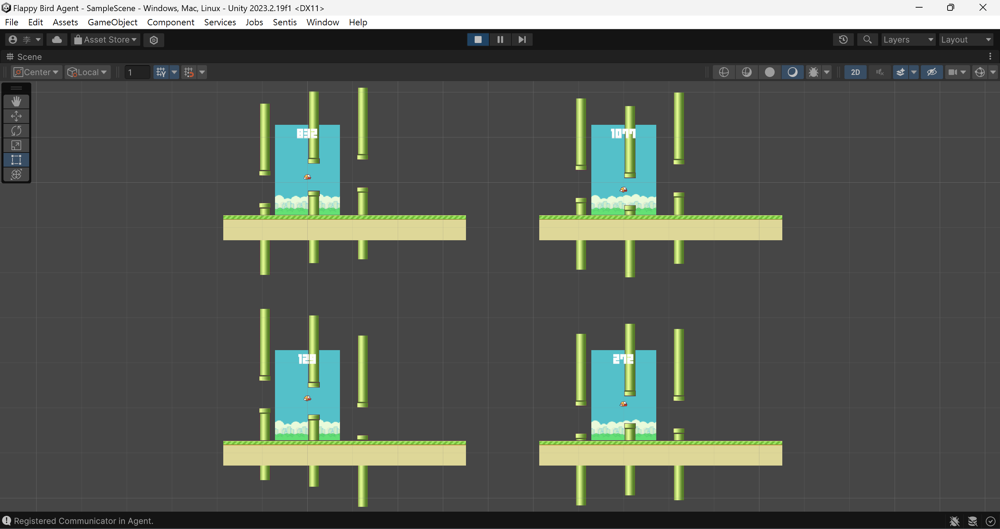
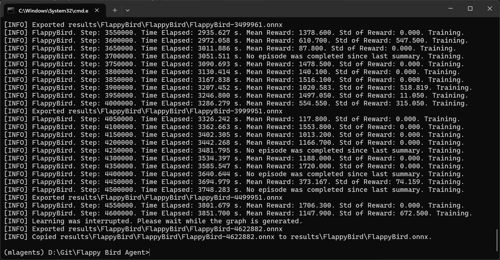
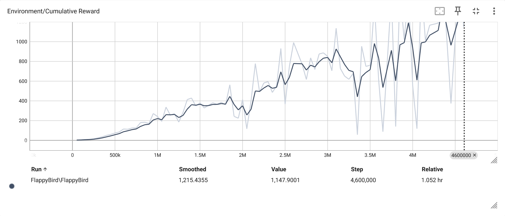
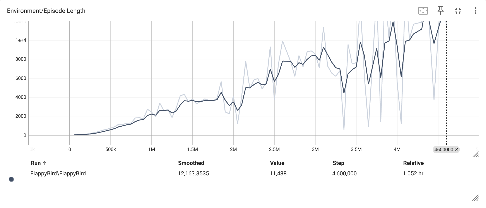
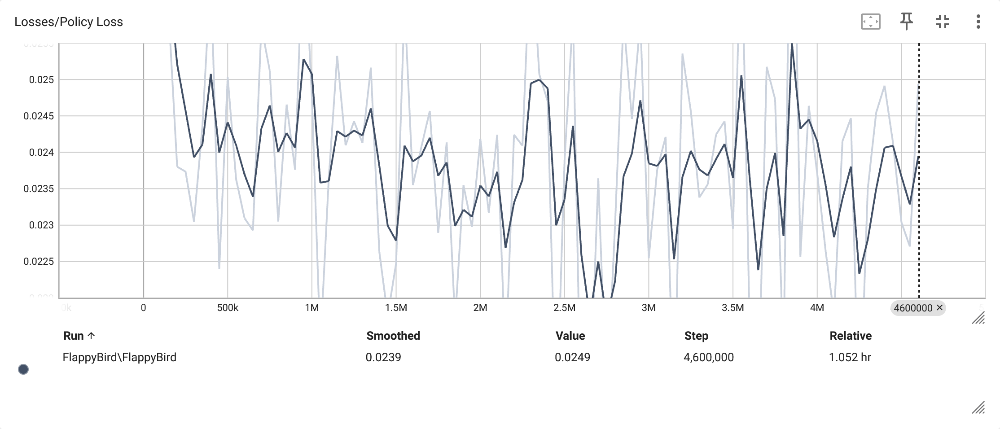
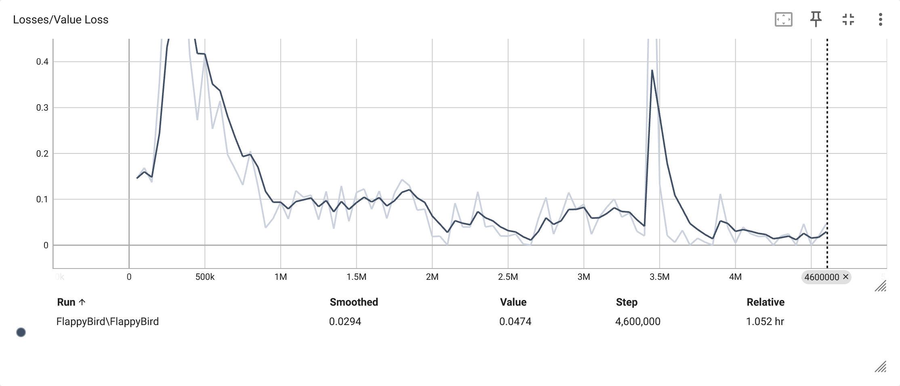

# Flappy-Bird-Agent

https://github.com/LeeYi-user/Flappy-Bird-Agent

## 說明

本程式為原創作品，主要使用 Unity ML-Agents 的強化學習框架，並搭配自製的 Flappy Bird 訓練環境。

## 指令

[安裝環境](https://unity-technologies.github.io/ml-agents/Installation/)
```
git clone https://github.com/Unity-Technologies/ml-agents.git
cd ml-agents
conda create -n mlagents python=3.10.12 && conda activate mlagents
pip3 install torch~=2.2.1 --index-url https://download.pytorch.org/whl/cu121
python -m pip install ./ml-agents-envs
python -m pip install ./ml-agents
```

啟動環境
```
conda activate mlagents
```

開始訓練
```
mlagents-learn config/FlappyBird.yaml --env="Builds/Flappy Bird Agent" --num-envs=16 --run-id=FlappyBird
```

中斷訓練
```
ctrl + c
```

繼續訓練
```
mlagents-learn config/FlappyBird.yaml --env="Builds/Flappy Bird Agent" --num-envs=16 --run-id=FlappyBird --resume
```

查看數據
```
tensorboard --logdir results
```

## 過程



## 結果











## 測試


