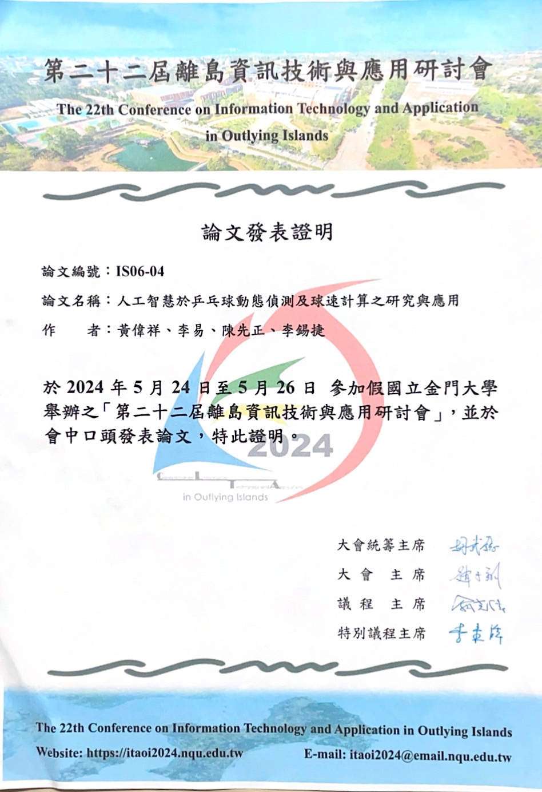

# 乒乓球捕捉

https://drive.google.com/drive/folders/1iMwlwkGMeSddexRhhMc1tdfD8mjeJW_u?usp=sharing

## 說明

本程式為原創作品，主要使用 Roboflow 平台的機器學習套件，並搭配自製的 Python 演算法。

## 測試

https://github.com/LeeYi-user/ai/assets/68934115/22b576e7-4b81-4421-99b9-4a459c5a0c21

https://github.com/LeeYi-user/ai/assets/68934115/89683b99-e7be-47a5-936a-06537e547254

## 論文發表證明

